# ResShift: Efficient Diffusion Model for Image Super-resolution by Residual Shifting (NeurIPS 2023, Spotlight) 

[Zongsheng Yue](https://zsyoaoa.github.io/), [Jianyi Wang](https://iceclear.github.io/), [Chen Change Loy](https://www.mmlab-ntu.com/person/ccloy/) 

[Conference Paper](https://arxiv.org/abs/2307.12348) | [Journal Paper](https://drive.google.com/file/d/1ck4HanNiRylisOWFGg_trjH22qR2A94Y/view?usp=sharing) | [Project Page](https://zsyoaoa.github.io/projects/resshift/) | [Video](https://www.youtube.com/watch?v=8DB-6Xvvl5o)

<a href="https://colab.research.google.com/drive/1CL8aJO7a_RA4MetanrCLqQO5H7KWO8KI?usp=sharing"></a> [](https://replicate.com/cjwbw/resshift) [](https://openxlab.org.cn/apps/detail/Zongsheng/ResShift)  


:star: If ResShift is helpful to your images or projects, please help star this repo. Thanks! :hugs: 

---
>Diffusion-based image super-resolution (SR) methods are mainly limited by the low inference speed due to the requirements of hundreds or even thousands of sampling steps. Existing acceleration sampling techniques inevitably sacrifice performance to some extent, leading to over-blurry SR results. To address this issue, we propose a novel and efficient diffusion model for SR that significantly reduces the number of diffusion steps, thereby eliminating the need for post-acceleration during inference and its associated performance deterioration. Our method constructs a Markov chain that transfers between the high-resolution image and the low-resolution image by shifting the residual between them, substantially improving the transition efficiency. Additionally, an elaborate noise schedule is developed to flexibly control the shifting speed and the noise strength during the diffusion process. Extensive experiments demonstrate that the proposed method obtains superior or at least comparable performance to current state-of-the-art methods on both synthetic and real-world datasets, *even only with 15 sampling steps*. 
>

---
## Update
- **2024.03.11**: Update the code for the Journal paper
- **2023.12.02**: Add configurations for the x2 super-resolution task.
- **2023.08.15**: Add [](https://openxlab.org.cn/apps/detail/Zongsheng/ResShift).
- **2023.08.15**: Add Gradio Demo.
- **2023.08.14**: Add bicubic (matlab resize) model.
- **2023.08.14**: Add [Project Page](https://zsyoaoa.github.io/projects/resshift/).
- **2023.08.02**: Add [Replicate](https://replicate.com/) demo [](https://replicate.com/cjwbw/resshift). 
- **2023.07.31**: Add Colab demo <a href="https://colab.research.google.com/drive/1CL8aJO7a_RA4MetanrCLqQO5H7KWO8KI?usp=sharing"></a>.  
- **2023.07.24**: Create this repo.

## Requirements
* Python 3.10, Pytorch 2.1.2, [xformers](https://github.com/facebookresearch/xformers) 0.0.23
* More detail (See [environment.yml](environment.yml))
A suitable [conda](https://conda.io/) environment named `resshift` can be created and activated with:

```
conda env create -f environment.yml
conda activate resshift
```

## Applications
### :point_right: Real-world image super-resolution
[](https://imgsli.com/MTkzNzgz) [](https://imgsli.com/MTkzNzgx)

[](https://imgsli.com/MTkzNzg0) [](https://imgsli.com/MTkzNzg3)

[](https://imgsli.com/MTkzNzkx) [](https://imgsli.com/MTkzNzk5) [](https://imgsli.com/MTkzNzk2) 

### :point_right: Image inpainting
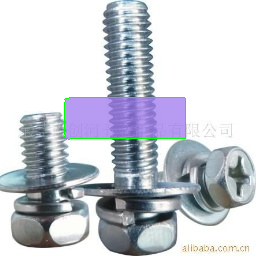 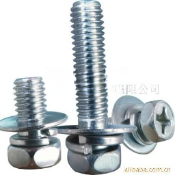 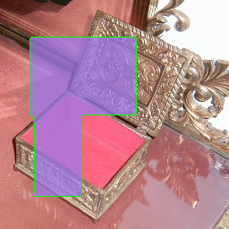 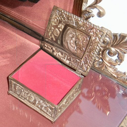 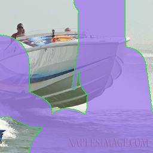 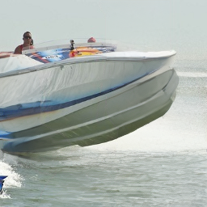 
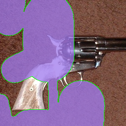 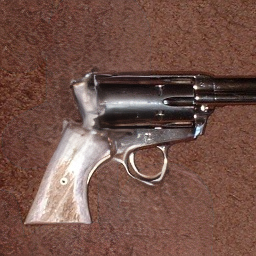 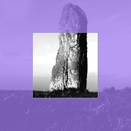 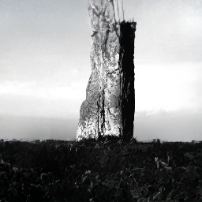 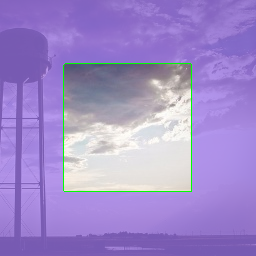 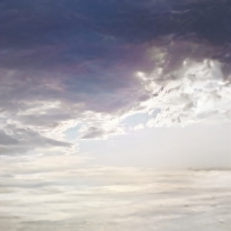 
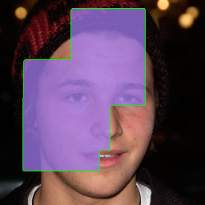 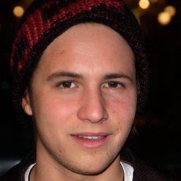 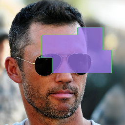 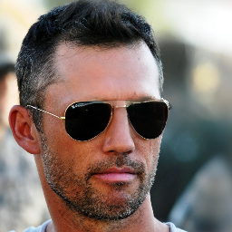 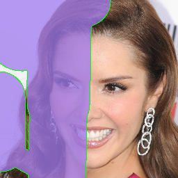 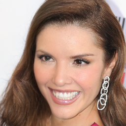 
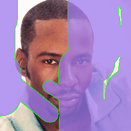 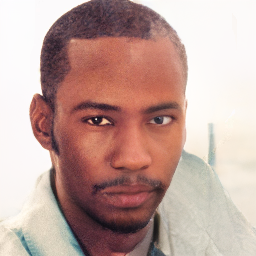 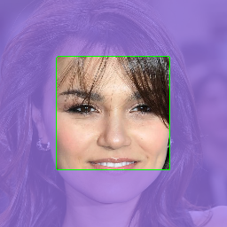 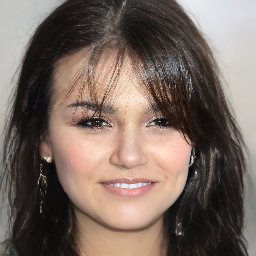 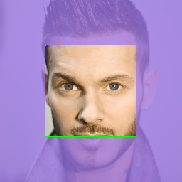 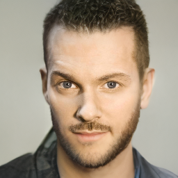 

### :point_right: Blind Face Restoration
 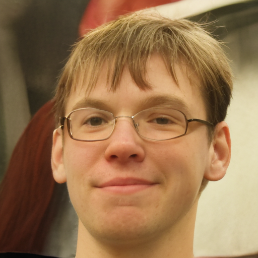  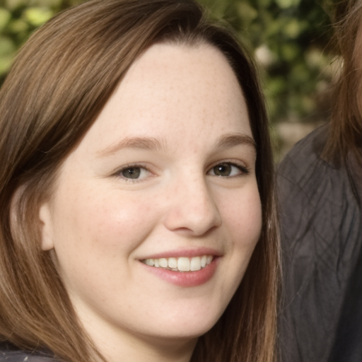  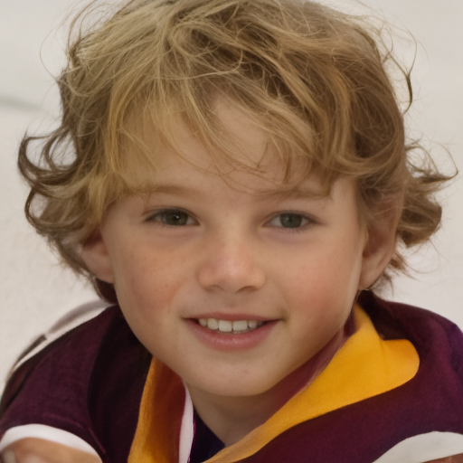 
 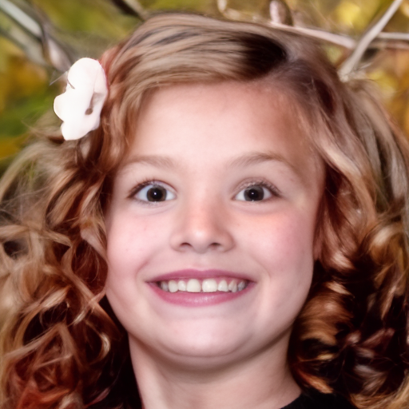  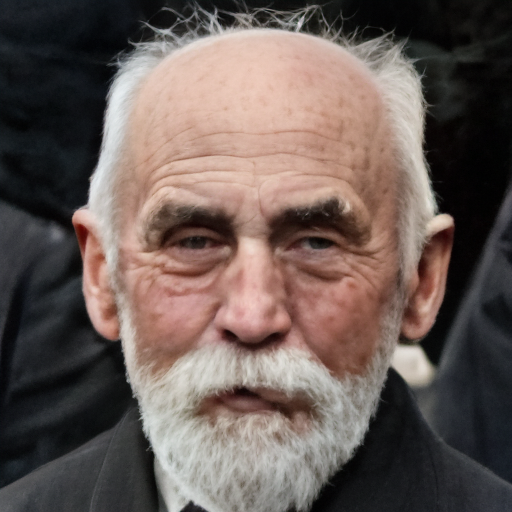  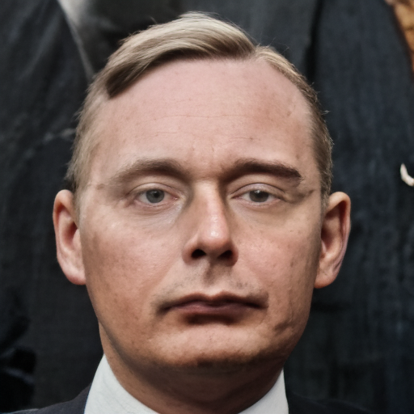 

## Online Demo
You can try our method through an online demo:
```
python app.py
```

## Fast Testing
#### :tiger: Real-world image super-resolution

```
python inference_resshift.py -i [image folder/image path] -o [result folder] --task realsr --scale 4 --version v3
```
#### :lion: Bicubic (resize by Matlab) image super-resolution
```
python inference_resshift.py -i [image folder/image path] -o [result folder] --task bicsr --scale 4
```
#### :snake: Natural image inpainting
```
python inference_resshift.py -i [image folder/image path] -o [result folder] --mask_path [mask path] --task inpaint_imagenet --scale 1
```
#### :crocodile: Face image inpainting
```
python inference_resshift.py -i [image folder/image path] -o [result folder] --mask_path [mask path] --task inpaint_face --scale 1
```
#### :octopus: Blind Face Restoration
```
python inference_resshift.py -i [image folder/image path] -o [result folder] --task faceir --scale 1
```

### Training
#### :turtle: Preparing stage
1. Download the pre-trained VQGAN model from this [link](https://github.com/zsyOAOA/ResShift/releases) and put it in the folder of 'weights'
2. Adjust the data path in the [config](configs) file. 
3. Adjust batchsize according your GPUS. 
    + configs.train.batch: [training batchsize, validation batchsize] 
    + configs.train.microbatch: total batchsize = microbatch * #GPUS * num_grad_accumulation

#### :dolphin: Real-world Image Super-resolution for NeurIPS
```
CUDA_VISIBLE_DEVICES=0,1,2,3,4,5,6,7 torchrun --standalone --nproc_per_node=8 --nnodes=1 main.py --cfg_path configs/realsr_swinunet_realesrgan256.yaml --save_dir [Logging Folder] 
```
#### :whale: Real-world Image Super-resolution for Journal
```
CUDA_VISIBLE_DEVICES=0,1,2,3,4,5,6,7 torchrun --standalone --nproc_per_node=8 --nnodes=1 main.py --cfg_path configs/realsr_swinunet_realesrgan256_journal.yaml --save_dir [Logging Folder] 
```
#### :ox: Image inpainting (Natural) for Journal
```
CUDA_VISIBLE_DEVICES=0,1,2,3,4,5,6,7 torchrun --standalone --nproc_per_node=8 --nnodes=1 main.py --cfg_path configs/inpaint_lama256_imagenet.yaml --save_dir [Logging Folder] 
```
#### :honeybee: Image inpainting (Face) for Journal
```
CUDA_VISIBLE_DEVICES=0,1,2,3,4,5,6,7 torchrun --standalone --nproc_per_node=8 --nnodes=1 main.py --cfg_path configs/inpaint_lama256_face.yaml --save_dir [Logging Folder] 
```
#### :frog: Blind face restoration for Journal
```
CUDA_VISIBLE_DEVICES=0,1,2,3,4,5,6,7 torchrun --standalone --nproc_per_node=8 --nnodes=1 main.py --cfg_path configs/faceir_gfpgan512_lpips.yaml --save_dir [Logging Folder] 
```

### Reproducing the results in our paper
#### :red_car: Prepare data
+ Synthetic data for image super-resolution: [Link](https://drive.google.com/file/d/1NhmpON2dB2LjManfX6uIj8Pj_Jx6N-6l/view?usp=sharing) 

+ Real data for image super-resolution: [RealSet65](testdata/RealSet65) | [RealSet80](testdata/RealSet80)

+ Synthetic data for natural image inpainting: [Link](https://drive.google.com/file/d/11_1xntiGnZzRX87Ve6thbeWDPVksTHNC/view?usp=sharing) 

+ Synthetic data for face image inpainting: [Link](https://drive.google.com/file/d/1nyfry2XjgA_qV8fS2_Y5TNQwtG5Irwux/view?usp=sharing) 

+ Synthetic data for blind face restoration: [Link](scripts/prepare_testing_celeba_faceir.py) 

#### :rocket: Image super-resolution
Reproduce the results in Table 3 of our NeurIPS paper:
```
python inference_resshift.py -i [image folder/image path] -o [result folder] --task realsr --scale 4 --version v1 --chop_size 64 --chop_stride 64 --bs 64
```
Reproduce the results in Table 4 of our NeurIPS paper:
```
python inference_resshift.py -i [image folder/image path] -o [result folder] --task realsr --scale 4 --version v1 --chop_size 512 --chop_stride 448
```
Reproduce the results in Table 2 of our Journal paper:
```
python inference_resshift.py -i [image folder/image path] -o [result folder] --task realsr --scale 4 --version v3 --chop_size 64 --chop_stride 64 --bs 64
```
Reproduce the results in Table 3 of our Journal paper:
```
python inference_resshift.py -i [image folder/image path] -o [result folder] --task realsr --scale 4 --version v3 --chop_size 512 --chop_stride 448
```
##### Model card:
+ version-1: Conference paper, 15 diffusion steps, trained with 300k iterations. 
+ version-2: Conference paper, 15 diffusion steps, trained with 500k iterations. 
+ version-3: Journal paper, 4 diffusion steps.

#### :airplane: Image inpainting
Reproduce the results in Table 4 of our Journal paper:
```
python inference_resshift.py -i [image folder/image path] -o [result folder] --mask_path [mask path] --task inpaint_imagenet --scale 1 --chop_size 256 --chop_stride 256 --bs 32
```
Reproduce the results in Table 5 of our Journal paper:
```
python inference_resshift.py -i [image folder/image path] -o [result folder] --mask_path [mask path] --task inpaint_face --scale 1 --chop_size 256 --chop_stride 256 --bs 32
```
#### :boat: Blind Face Restoration
Reproduce the results in Table 6 of our Journal paper (arXiv):
```
python inference_resshift.py -i [image folder/image path] -o [result folder] --task faceir --scale 1 --chop_size 256 --chop_stride 256 --bs 16
```

<!--## Note on General Restoration Task-->
<!--For general restoration task, please adjust the settings in the config file:-->
<!--```-->
<!--model.params.lq_size: resolution of the low-quality image.   # should be divided by 64-->
<!--diffusion.params.sf: scale factor for super-resolution,  1 for restoration task.-->
<!--degradation.sf: scale factor for super-resolution, 1 for restoration task.   # only required for the pipeline of Real-Esrgan     -->
<!--```-->
<!--In some cases, you need to rewrite the data loading process. -->

## License

This project is licensed under <a rel="license" href="https://github.com/sczhou/CodeFormer/blob/master/LICENSE">NTU S-Lab License 1.0</a>. Redistribution and use should follow this license.

## Acknowledgement

This project is based on [Improved Diffusion Model](https://github.com/openai/improved-diffusion), [LDM](https://github.com/CompVis/latent-diffusion), and [BasicSR](https://github.com/XPixelGroup/BasicSR). We also adopt [Real-ESRGAN](https://github.com/xinntao/Real-ESRGAN) to synthesize the training data for real-world super-resolution. Thanks for their awesome works.

### Contact
If you have any questions, please feel free to contact me via `zsyzam@gmail.com`.
