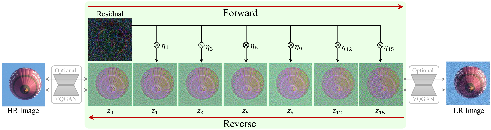
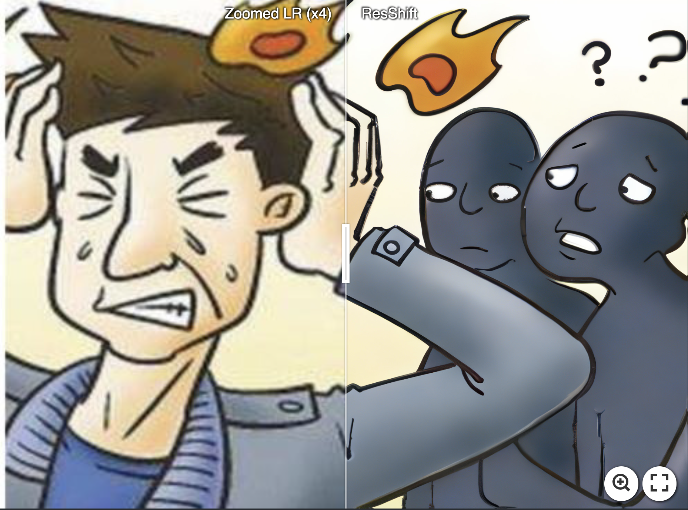
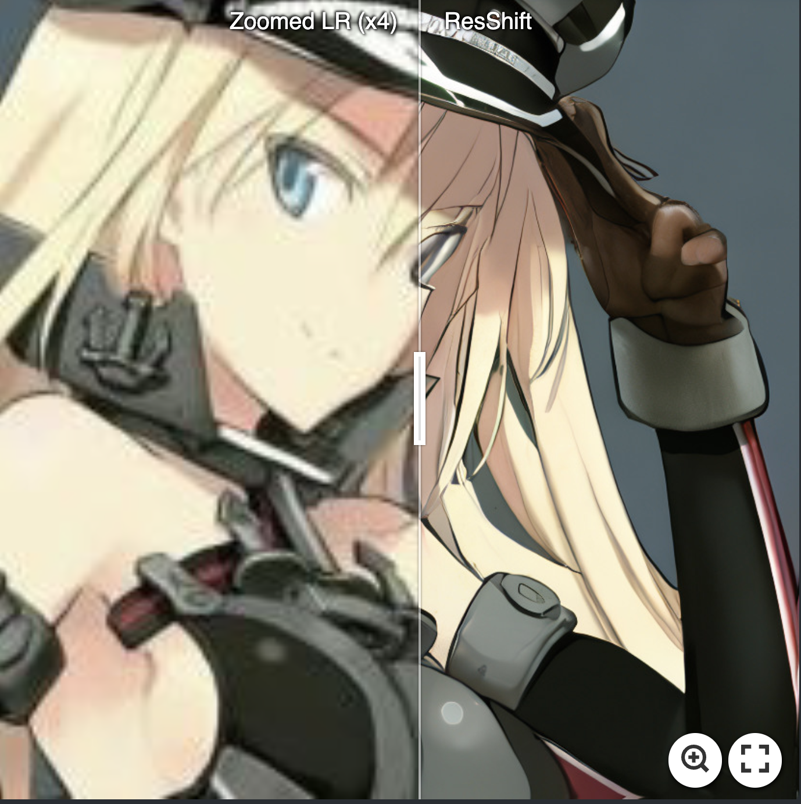
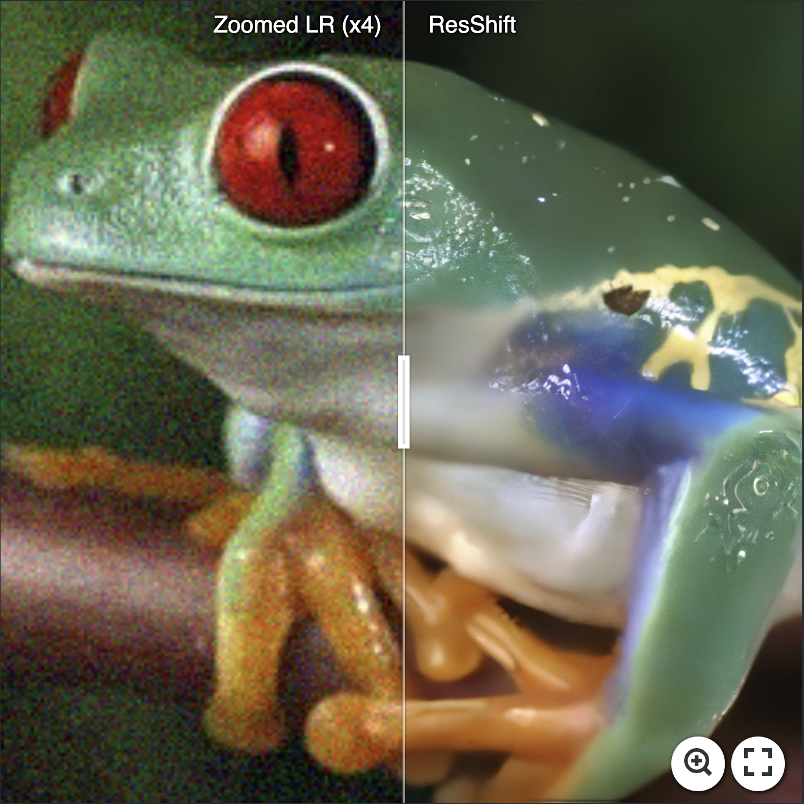
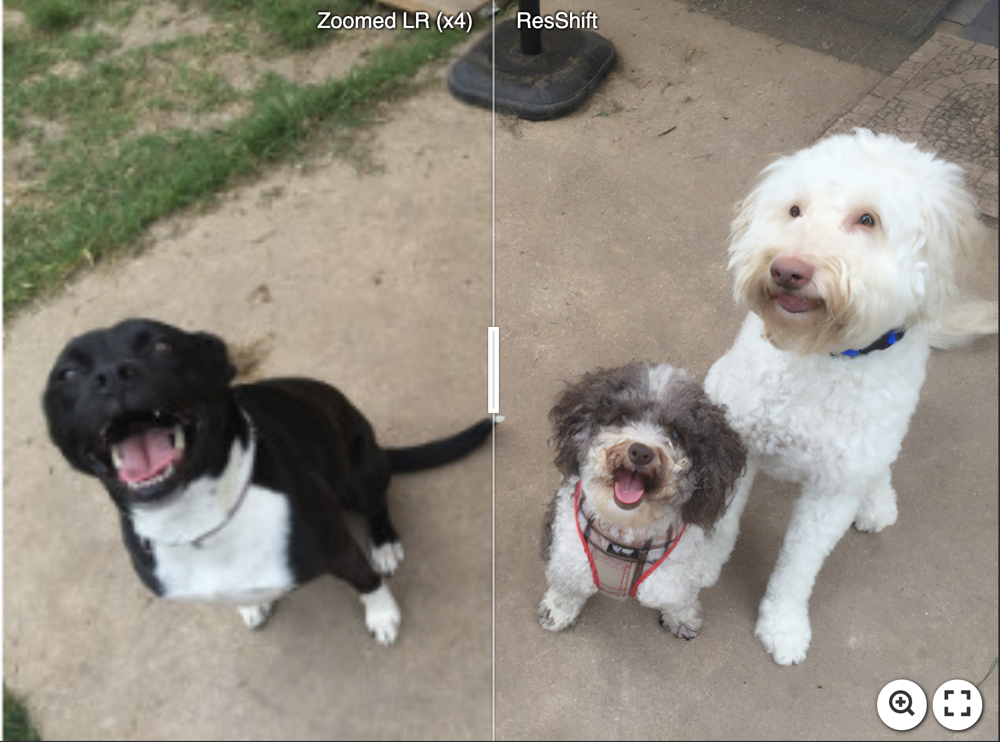
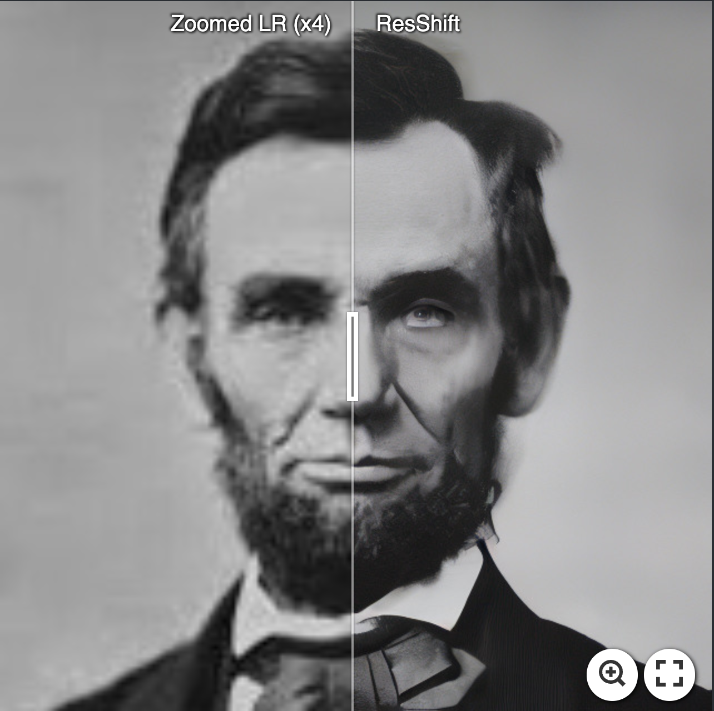
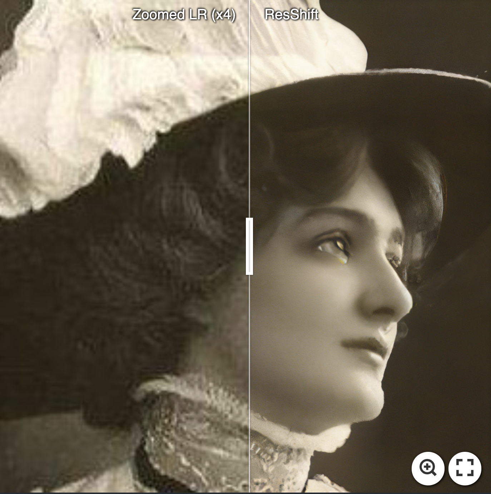

# ResShift: Efficient Diffusion Model for Image Super-resolution by Residual Shifting (NeurIPS 2023, Spotlight) 

[Zongsheng Yue](https://zsyoaoa.github.io/), [Jianyi Wang](https://iceclear.github.io/), [Chen Change Loy](https://www.mmlab-ntu.com/person/ccloy/) 

[Paper](https://arxiv.org/abs/2307.12348) | [Project Page](https://zsyoaoa.github.io/projects/resshift/) | [Video](https://www.youtube.com/watch?v=8DB-6Xvvl5o)

<a href="https://colab.research.google.com/drive/1CL8aJO7a_RA4MetanrCLqQO5H7KWO8KI?usp=sharing"></a> [](https://replicate.com/cjwbw/resshift) [](https://openxlab.org.cn/apps/detail/Zongsheng/ResShift)  


:star: If ResShift is helpful to your images or projects, please help star this repo. Thanks! :hugs: 

---
>Diffusion-based image super-resolution (SR) methods are mainly limited by the low inference speed due to the requirements of hundreds or even thousands of sampling steps. Existing acceleration sampling techniques inevitably sacrifice performance to some extent, leading to over-blurry SR results. To address this issue, we propose a novel and efficient diffusion model for SR that significantly reduces the number of diffusion steps, thereby eliminating the need for post-acceleration during inference and its associated performance deterioration. Our method constructs a Markov chain that transfers between the high-resolution image and the low-resolution image by shifting the residual between them, substantially improving the transition efficiency. Additionally, an elaborate noise schedule is developed to flexibly control the shifting speed and the noise strength during the diffusion process. Extensive experiments demonstrate that the proposed method obtains superior or at least comparable performance to current state-of-the-art methods on both synthetic and real-world datasets, *even only with 15 sampling steps*. 
>

---
## Update
- **2023.12.02**: Add configurations for the x2 super-resolution task.
- **2023.08.15**: Add [](https://openxlab.org.cn/apps/detail/Zongsheng/ResShift).
- **2023.08.15**: Add Gradio Demo.
- **2023.08.14**: Add bicubic (matlab resize) model.
- **2023.08.14**: Add [Project Page](https://zsyoaoa.github.io/projects/resshift/).
- **2023.08.02**: Add [Replicate](https://replicate.com/) demo [](https://replicate.com/cjwbw/resshift). 
- **2023.07.31**: Add Colab demo <a href="https://colab.research.google.com/drive/1CL8aJO7a_RA4MetanrCLqQO5H7KWO8KI?usp=sharing"></a>.  
- **2023.07.24**: Create this repo.

## Requirements
* Python 3.9.16, Pytorch 1.12.1, [xformers](https://github.com/facebookresearch/xformers) 0.0.20
* More detail (See [environment.yaml](environment.yml))
A suitable [conda](https://conda.io/) environment named `ResShift` can be created and activated with:

```
conda env create -f environment.yaml
conda activate ResShift
```

## Applications
### :point_right: Real-world image super-resolution
[](https://imgsli.com/MTkzNzgz) [](https://imgsli.com/MTkzNzgx)

[](https://imgsli.com/MTkzNzg0) [](https://imgsli.com/MTkzNzg3)

[](https://imgsli.com/MTkzNzkx) [](https://imgsli.com/MTkzNzk5) [](https://imgsli.com/MTkzNzk2) 

## Online Demo
You can try our method through an online demo:
```
CUDA_VISIBLE_DEVICES=gpu_id python app.py
```

## Inference
#### :tiger: Real-world image super-resolution
```
CUDA_VISIBLE_DEVICES=gpu_id python inference_resshift.py -i [image folder/image path] -o [result folder] --scale 4 --task realsrx4 --chop_size 512
```
#### :lion: Bicubic (resize by Opencv) image super-resolution
```
CUDA_VISIBLE_DEVICES=gpu_id python inference_resshift.py -i [image folder/image path] -o [result folder] --scale 4 --task bicsrx4_opencv --chop_size 512
```
#### :lion: Bicubic (resize by Matlab) image super-resolution
```
CUDA_VISIBLE_DEVICES=gpu_id python inference_resshift.py -i [image folder/image path] -o [result folder] --scale 4 --task bicsrx4_matlab --chop_size 512
```

## Training
#### :turtle: Prepare data
Download the training data and add the data path to the config file (data.train.params.dir_path or data.train.params.txt_file_path). To synthesize the testing dataset utilized in our paper, please refer to these [scripts](./scripts/).
* Real-world and Bicubic image super-resolution: [ImageNet](https://www.image-net.org/) and [FFHQ](https://github.com/NVlabs/ffhq-dataset) (resized to 256x256) 
#### :dolphin: Real-world Image Super-resolution
```
CUDA_VISIBLE_DEVICES=0,1,2,3 torchrun --standalone --nproc_per_node=4 --nnodes=1 main.py --cfg_path configs/realsr_swinunet_realesrgan256.yaml --save_dir [Logging Folder] --steps 15
```
#### :whale: Bicubic Image Super-resolution
```
CUDA_VISIBLE_DEVICES=0,1,2,3 torchrun --standalone --nproc_per_node=4 --nnodes=1 main.py --cfg_path configs/bicubic_swinunet_bicubic256.yaml --save_dir [Logging Folder]  --steps 15
```

## Note on General Restoration Task
For general restoration task, please adjust the settings in the config file:
```
model.params.lq_size: resolution of the low-quality image.   # should be divided by 64
diffusion.params.sf: scale factor for super-resolution,  1 for restoration task.
degradation.sf: scale factor for super-resolution, 1 for restoration task.   # only required for the pipeline of Real-Esrgan     
```
In some cases, you need to rewrite the data loading process. 

## License

This project is licensed under <a rel="license" href="https://github.com/sczhou/CodeFormer/blob/master/LICENSE">NTU S-Lab License 1.0</a>. Redistribution and use should follow this license.

## Acknowledgement

This project is based on [Improved Diffusion Model](https://github.com/openai/improved-diffusion), [LDM](https://github.com/CompVis/latent-diffusion), and [BasicSR](https://github.com/XPixelGroup/BasicSR). We also adopt [Real-ESRGAN](https://github.com/xinntao/Real-ESRGAN) to synthesize the training data for real-world super-resolution. Thanks for their awesome works.

### Contact
If you have any questions, please feel free to contact me via `zsyzam@gmail.com`.
